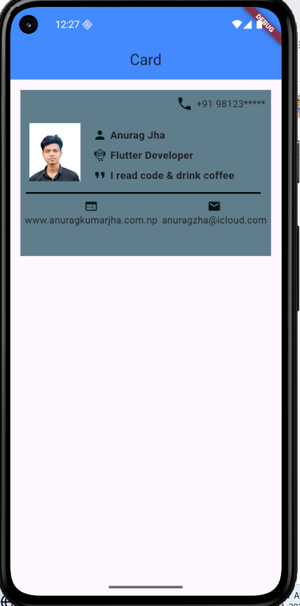

# cards_connect

## App Screenshot

## Objective:
Design a visually appealing Intro Card using Flutter widgets — primarily Container, Row, Column, and Text.
This assignment helps you understand layout design, alignment, and styling in Flutter.
Tasks:Create an Intro Card
Build a single card that displays a user’s basic information. The card should include:
## Design Requirements:
Outer Container:
Width: around 300
Padding & Margin

## Left Side (in a Row):
A Container (circular) to represent a profile picture (use CircleAvatar if needed)
## Right Side (in a Column):
A Text widget for the name (e.g., John Doe)
A Text widget for a title/role (e.g., Flutter Developer)
A Text widget for a short description or quote

## Getting Started

This project is a starting point for a Flutter application.

A few resources to get you started if this is your first Flutter project:

- [Lab: Write your first Flutter app](https://docs.flutter.dev/get-started/codelab)
- [Cookbook: Useful Flutter samples](https://docs.flutter.dev/cookbook)

For help getting started with Flutter development, view the
[online documentation](https://docs.flutter.dev/), which offers tutorials,
samples, guidance on mobile development, and a full API reference.
